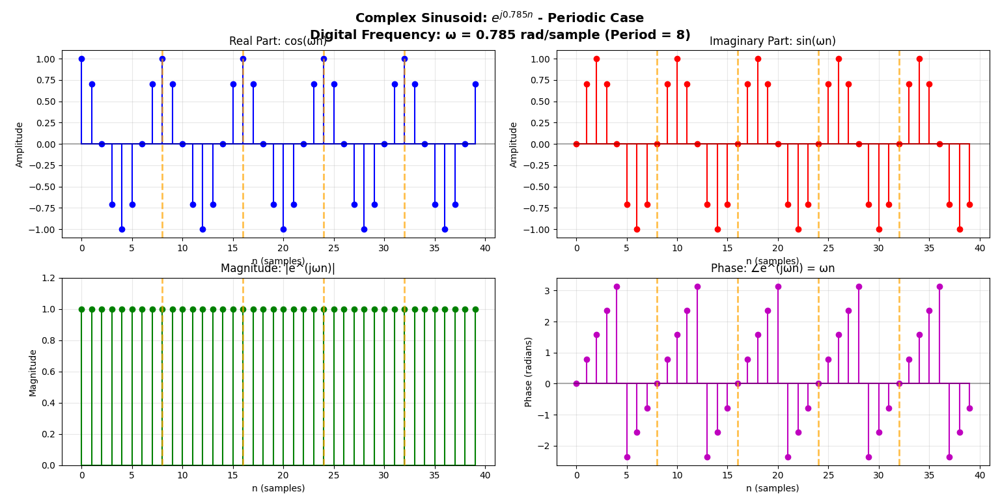
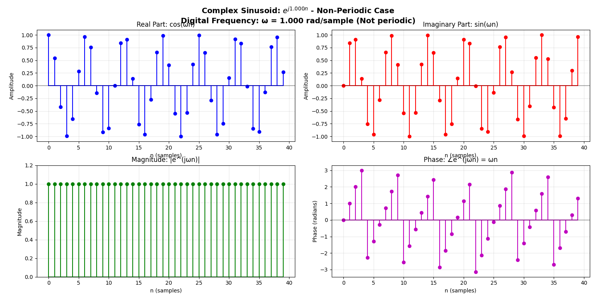
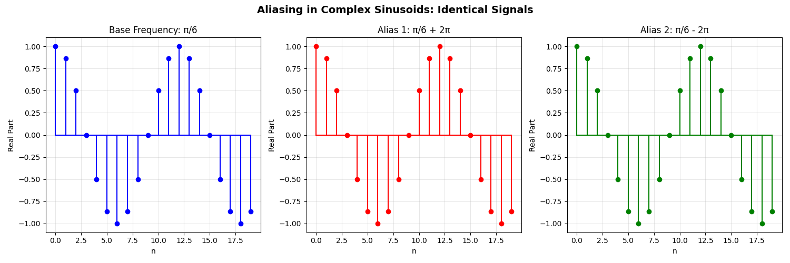
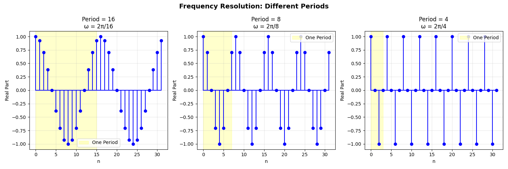

# Digital Signal Processing: First Steps into the Digital World

**Your First Kick into Digital Signal Processing** - A hands-on Python journey through fundamental DSP concepts.

## 🎯 Welcome to DSP

This project serves as your introduction to the fascinating world of Digital Signal Processing. We'll explore the fundamental questions that define this field:

- **What is a signal?** - Understanding data that varies with time, space, or other variables
- **What is a system?** - How we process and transform signals
- **Analog vs. Digital** - The bridge between continuous-time and discrete-time worlds
- **Signal Properties** - The mathematical characteristics that define signal behavior

## 🌟 Why Start Here?

Digital Signal Processing is everywhere - from the music you stream to the photos you take, from medical imaging to space communications. This project focuses on two cornerstone concepts that form the foundation of all DSP work:

1. **Signal Decomposition** - Breaking down complex signals into simpler, understandable parts
2. **Complex Sinusoids & Periodicity** - Understanding the building blocks of frequency domain analysis

These concepts bridge the gap between theoretical mathematics and practical signal processing applications.

## 📋 Features

### Current Implementations
- **Signal Decomposition**: Decompose any discrete signal into even and odd components
  - Arbitrary signals
  - Exponential signals  
  - Sinusoidal signals
  - Mathematical verification

- **Complex Sinusoids and Periodicity**: Analyze when complex sinusoids are periodic
  - Periodicity conditions and analysis
  - Periodic vs non-periodic examples
  - Aliasing relationships (frequencies differing by 2π)
  - Frequency resolution and observation length effects

### Planned Features
- Fourier Transform visualizations
- Filter design and analysis
- Convolution demonstrations
- Sampling and aliasing effects
- Window functions comparison

## 🚀 Getting Started

### Prerequisites
- Python 3.8 or higher
- pip package manager

### Installation

1. Clone or download this project
2. Navigate to the project directory
3. Install required dependencies:
   ```bash
   pip install -r requirements.txt
   ```

### Running the Examples

**Signal Decomposition:**
```bash
python signal_decomposition.py
```

This will display:
- Three different signal examples
- Interactive plots showing original signals and their even/odd decompositions
- Mathematical verification that original = even + odd parts

**Complex Sinusoids and Periodicity:**
```bash
python complex_sinusoids.py
```

This will demonstrate:
- Periodicity analysis for different frequencies
- Comparison between periodic and non-periodic complex sinusoids
- Aliasing relationships between frequencies
- Frequency resolution effects

## 📚 Educational Content

### Signal Decomposition Theory

Any discrete signal x[n] can be uniquely decomposed into:
- **Even part**: `x_e[n] = (x[n] + x[-n])/2`
- **Odd part**: `x_o[n] = (x[n] - x[-n])/2`

Where:
- Even signals are symmetric: `x_e[n] = x_e[-n]`
- Odd signals are antisymmetric: `x_o[n] = -x_o[-n]`
- Reconstruction: `x[n] = x_e[n] + x_o[n]`

### Complex Sinusoids and Periodicity Theory

Complex sinusoids have the form `x[n] = e^(jωn) = cos(ωn) + j*sin(ωn)` where:
- **Periodicity Condition**: A complex sinusoid is periodic if `ω = 2πk/N` for integers k and N
- **Period**: The fundamental period is N when `ωN = 2πk`
- **Frequency Range**: Unique frequencies exist only in the range `[0, 2π)` or `[-π, π)`
- **Aliasing**: Frequencies differing by `2πm` (m integer) produce identical signals
- **Resolution**: Minimum resolvable frequency difference is `2π/N` for N-sample observation

## 📊 Example Outputs

The script generates three comprehensive figures, each with detailed visualizations:

### Figure 1: Arbitrary Discrete Signal Decomposition
- **Signal**: `x[n] = [2, 1, -1, 3, 2]` for `n = [0, 1, 2, 3, 4]`
- **Layout**: 2×2 subplot grid showing:
  - **Top-left**: Original signal x[n] (blue stems)
  - **Top-right**: Even part x_e[n] = (x[n] + x[-n])/2 (green stems)
  - **Bottom-left**: Odd part x_o[n] = (x[n] - x[-n])/2 (red stems)
  - **Bottom-right**: Verification plot (magenta: reconstructed, black dashed: original)
- **Purpose**: Demonstrates basic decomposition principles with an arbitrary signal


### Figure 2: Exponential Signal Decomposition  
- **Signal**: `x[n] = 0.8^n` for `n = [0, 1, 2, 3, 4, 5]`
- **Layout**: Same 2×2 subplot structure as Figure 1
- **Key Insight**: Shows how exponential decay signals contain both even and odd components
- **Mathematical significance**: Demonstrates that exponential functions have non-zero even and odd parts


### Figure 3: Sinusoidal Signal Decomposition
- **Signal**: `x[n] = sin(π/4 × n)` for `n = [-5, -4, ..., 4, 5]`
- **Layout**: Same 2×2 subplot structure as previous figures
- **Key Properties Demonstrated**:
  - Even part ≈ 0 (confirming sine is an odd function)
  - Odd part equals the original signal
  - Perfect mathematical verification of sine function properties
- **Educational Value**: Reinforces the theoretical property that sine functions are purely odd


Each figure includes:
- Color-coded stem plots for easy distinction
- Grid lines for precise reading of values
- Mathematical formulas in subplot titles
- Verification plots showing perfect reconstruction

### Complex Sinusoids and Periodicity Visualizations

The complex sinusoids script generates four detailed visualizations:

### Figure 4: Periodic Complex Sinusoid (ω = π/4)
- **Signal**: `x[n] = e^(jπn/4)` - Periodic with period N = 8
- **Layout**: 2×2 subplot showing:
  - **Top-left**: Real part cos(πn/4) 
  - **Top-right**: Imaginary part sin(πn/4)
  - **Bottom-left**: Magnitude |e^(jπn/4)| = 1
  - **Bottom-right**: Phase ∠e^(jπn/4) = πn/4
- **Key Feature**: Orange dashed lines mark period boundaries (every 8 samples)



### Figure 5: Non-Periodic Complex Sinusoid (ω = 1.0)
- **Signal**: `x[n] = e^(j1.0n)` - Non-periodic (ω/(2π) ≈ 0.159 is irrational)
- **Layout**: Same 2×2 subplot structure as Figure 4
- **Key Insight**: No repeating pattern visible - demonstrates non-periodic behavior
- **Mathematical Significance**: Shows what happens when ω is not a rational multiple of 2π



### Figure 6: Aliasing Relationship Demonstration
- **Signals**: Three identical complex sinusoids with frequencies ω, ω+2π, ω-2π
- **Layout**: 1×3 subplot showing real parts of:
  - **Left**: Base frequency ω = π/6
  - **Center**: Aliased frequency ω + 2π = π/6 + 2π  
  - **Right**: Aliased frequency ω - 2π = π/6 - 2π
- **Key Property**: All three signals are mathematically identical (aliasing effect)



### Figure 7: Frequency Resolution and Period Comparison
- **Signals**: Three periodic complex sinusoids with different periods
- **Layout**: 1×3 subplot comparing:
  - **Left**: Period = 16 samples (ω = 2π/16)
  - **Center**: Period = 8 samples (ω = 2π/8)
  - **Right**: Period = 4 samples (ω = 2π/4)
- **Educational Value**: Shows relationship between frequency and period
- **Yellow highlighting**: Indicates one complete period for each signal



## 🛠️ Project Structure

```
Digital Signal Processing/
├── signal_decomposition.py    # Signal decomposition into even/odd parts
├── complex_sinusoids.py       # Complex sinusoids and periodicity analysis
├── requirements.txt           # Python dependencies
├── README.md                  # This file
├── Figure_1.png              # Arbitrary signal decomposition
├── Figure_2.png              # Exponential signal decomposition
├── Figure_3.png              # Sinusoidal signal decomposition
├── Figure_4.png              # Periodic complex sinusoid (ω = π/4)
├── Figure_5.png              # Non-periodic complex sinusoid (ω = 1.0)
├── Figure_6.png              # Aliasing relationship demonstration
├── Figure_7.png              # Frequency resolution and period comparison
└── .github/
    └── copilot-instructions.md  # AI coding assistant guidelines
```

## 🔧 Dependencies

- **numpy**: Numerical computing
- **matplotlib**: Plotting and visualization
- **scipy**: Scientific computing and signal processing
- **seaborn**: Statistical data visualization (optional)
- **plotly**: Interactive plots (optional)
- **jupyter**: Interactive development (optional)

## 🎓 Learning Journey - Your DSP Foundation

This project covers essential topics that form the bedrock of Digital Signal Processing:

### **Signal Fundamentals**
- Understanding what signals and systems are
- Distinguishing between continuous-time (analog) and discrete-time (digital) signals
- Signal transformations: flipping, scaling, and shifting operations
- Combining transformations and understanding order of operations

### **Signal Properties & Analysis**
- **Even and Odd Decomposition** - Every signal can be broken into symmetric and antisymmetric parts
- **Periodicity** - Understanding when and why signals repeat
- **Special Signals** - Delta functions, unit steps, and their relationships
- **Complex Numbers in DSP** - Magnitude, phase, and Euler's formula applications

### **Complex Exponentials & Sinusoids**
- Real and complex exponential signals
- The relationship between time and frequency domains
- **Discrete-time sinusoids** and their 2π-periodic nature
- **Periodicity conditions** for complex sinusoids
- **Aliasing effects** in discrete-time processing

### **Mathematical Skills Developed**
- Signal decomposition techniques
- Complex number manipulation in signal processing context
- Understanding sampling and discrete-time signal properties
- Frequency domain concepts and relationships

## 🚀 What's Next?

This foundation prepares you for advanced DSP topics including:
- Fourier Transform analysis
- Digital filter design
- Spectral analysis techniques
- Advanced signal processing applications

## 🤝 Contributing

Feel free to add more DSP visualization examples! Follow the existing code structure:
1. Clear mathematical documentation
2. Multiple example cases
3. Visual verification
4. Educational comments

## � Academic Reference

This project implements concepts from **Section 2.1** of standard DSP textbooks (Proakis and Manolakis, 4th ed.), providing hands-on Python implementations of theoretical concepts.

## �📄 License

This project is for educational purposes. Feel free to use and modify for learning DSP concepts.

---

**Your First Steps into Digital Signal Processing**  
**Author**: DSP Student  
**Date**: June 26, 2025  
**Foundation Course**: Digital Signal Processing Fundamentals
