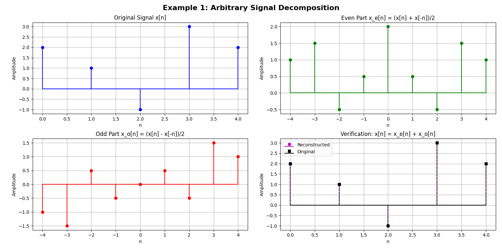
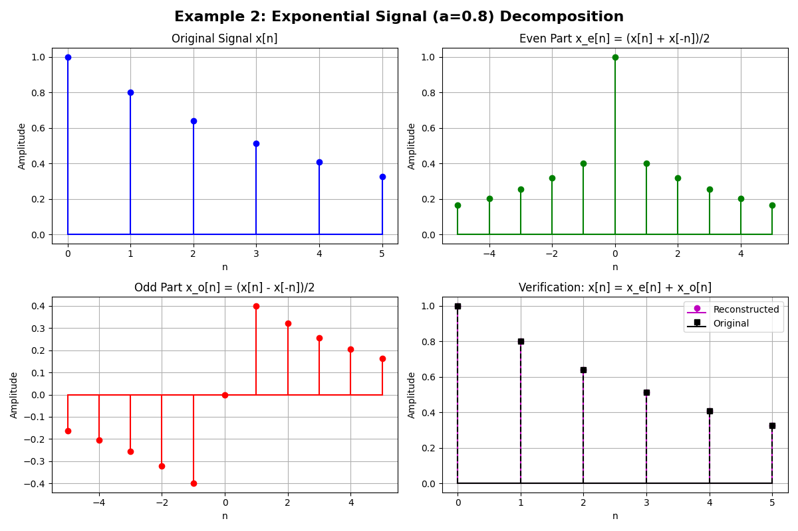
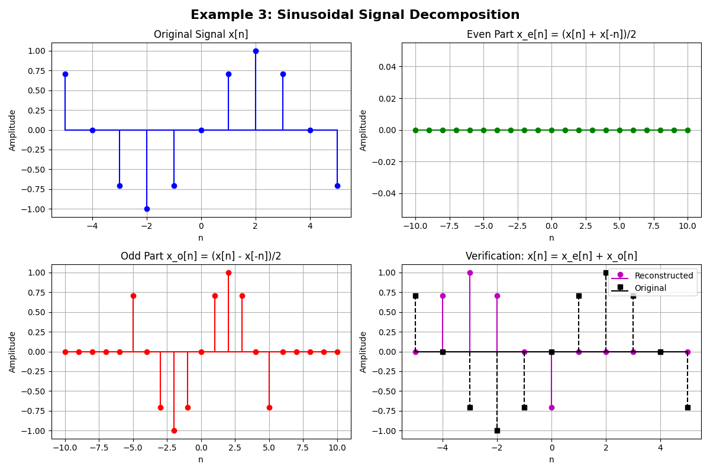

# Digital Signal Processing Visualizations

A Python project for creating educational visualizations of Digital Signal Processing concepts.

## 🎯 Project Overview

This project provides interactive Python demonstrations of fundamental DSP concepts, starting with signal decomposition into even and odd parts. Each example includes theoretical background, mathematical formulations, and visual demonstrations.

## 📋 Features

### Current Implementations
- **Signal Decomposition**: Decompose any discrete signal into even and odd components
  - Arbitrary signals
  - Exponential signals  
  - Sinusoidal signals
  - Mathematical verification

### Planned Features
- Fourier Transform visualizations
- Filter design and analysis
- Convolution demonstrations
- Sampling and aliasing effects
- Window functions comparison

## 🚀 Getting Started

### Prerequisites
- Python 3.8 or higher
- pip package manager

### Installation

1. Clone or download this project
2. Navigate to the project directory
3. Install required dependencies:
   ```bash
   pip install -r requirements.txt
   ```

### Running the Examples

Run the signal decomposition example:
```bash
python signal_decomposition.py
```

This will display:
- Three different signal examples
- Interactive plots showing original signals and their even/odd decompositions
- Mathematical verification that original = even + odd parts

## 📚 Educational Content

### Signal Decomposition Theory

Any discrete signal x[n] can be uniquely decomposed into:
- **Even part**: `x_e[n] = (x[n] + x[-n])/2`
- **Odd part**: `x_o[n] = (x[n] - x[-n])/2`

Where:
- Even signals are symmetric: `x_e[n] = x_e[-n]`
- Odd signals are antisymmetric: `x_o[n] = -x_o[-n]`
- Reconstruction: `x[n] = x_e[n] + x_o[n]`

## 📊 Example Outputs

The script generates three comprehensive figures, each with detailed visualizations:

### Figure 1: Arbitrary Discrete Signal Decomposition
- **Signal**: `x[n] = [2, 1, -1, 3, 2]` for `n = [0, 1, 2, 3, 4]`
- **Layout**: 2×2 subplot grid showing:
  - **Top-left**: Original signal x[n] (blue stems)
  - **Top-right**: Even part x_e[n] = (x[n] + x[-n])/2 (green stems)
  - **Bottom-left**: Odd part x_o[n] = (x[n] - x[-n])/2 (red stems)
  - **Bottom-right**: Verification plot (magenta: reconstructed, black dashed: original)
- **Purpose**: Demonstrates basic decomposition principles with an arbitrary signal



### Figure 2: Exponential Signal Decomposition  
- **Signal**: `x[n] = 0.8^n` for `n = [0, 1, 2, 3, 4, 5]`
- **Layout**: Same 2×2 subplot structure as Figure 1
- **Key Insight**: Shows how exponential decay signals contain both even and odd components
- **Mathematical significance**: Demonstrates that exponential functions have non-zero even and odd parts



### Figure 3: Sinusoidal Signal Decomposition
- **Signal**: `x[n] = sin(π/4 × n)` for `n = [-5, -4, ..., 4, 5]`
- **Layout**: Same 2×2 subplot structure as previous figures
- **Key Properties Demonstrated**:
  - Even part ≈ 0 (confirming sine is an odd function)
  - Odd part equals the original signal
  - Perfect mathematical verification of sine function properties
- **Educational Value**: Reinforces the theoretical property that sine functions are purely odd



Each figure includes:
- Color-coded stem plots for easy distinction
- Grid lines for precise reading of values
- Mathematical formulas in subplot titles
- Verification plots showing perfect reconstruction

## 🛠️ Project Structure

```
Digital Signal Processing/
├── signal_decomposition.py    # Main signal decomposition demo
├── requirements.txt           # Python dependencies
├── README.md                 # This file
```

## 🔧 Dependencies

- **numpy**: Numerical computing
- **matplotlib**: Plotting and visualization
- **scipy**: Scientific computing and signal processing
- **seaborn**: Statistical data visualization (optional)
- **plotly**: Interactive plots (optional)
- **jupyter**: Interactive development (optional)

## 🎓 Learning Objectives

After running these examples, you should understand:
- How any signal can be decomposed into even and odd parts
- The mathematical relationship between original and decomposed signals
- Visual interpretation of even (symmetric) and odd (antisymmetric) signals
- Practical implementation of signal decomposition in Python

## 🤝 Contributing

Feel free to add more DSP visualization examples! Follow the existing code structure:
1. Clear mathematical documentation
2. Multiple example cases
3. Visual verification
4. Educational comments

## 📄 License

This project is for educational purposes. Feel free to use and modify for learning DSP concepts.

---

**Author**: DSP Student  
**Date**: June 25, 2025  
**Course**: Digital Signal Processing
